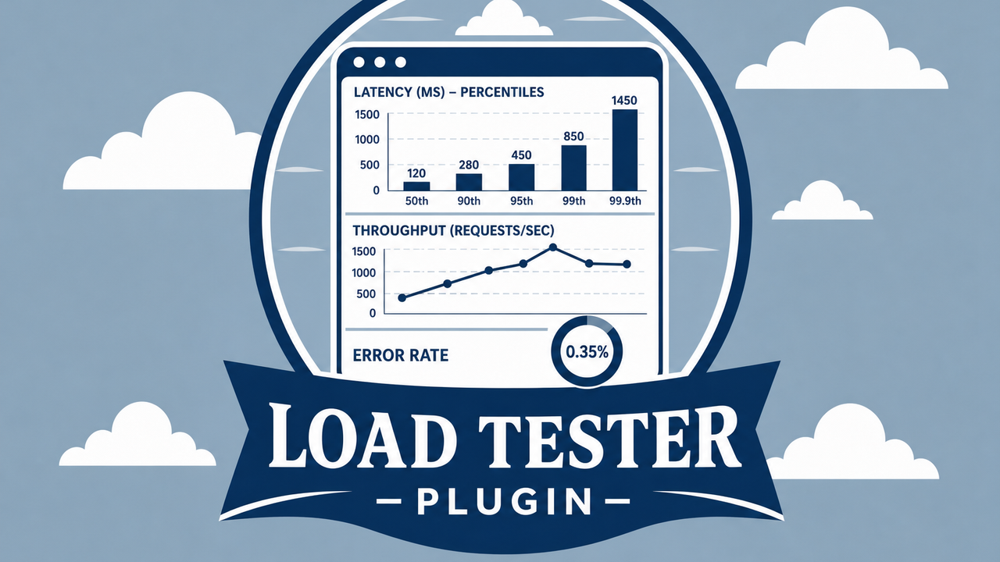

# Load Tester

HarborClient plugin that drives repeated HTTP requests against the active request or an entire collection/folder and charts latency, throughput, and error rate.



## Features

- **Load Tester** request tab — configure total requests, concurrency, timeout, delay, and keep-alive preference, then run a load test for the open request.
- **Load Testing** response tab — view latency-over-time, percentile, and status distribution charts for the active request.
- **Collection / folder menu** — choose **Load Test** from the sidebar hamburger menu to open a modal with the same form and run against every saved request in scope.

## Permissions

- `ui` — request/response tabs, status bar modal host, and context menu action
- `storage` — persist load test results and progress across sessions
- `database` — optional plugin database schema for future run history
- `filesystem:pick` — export load test reports via a save dialog
- `network` — send load test requests through HarborClient’s main-process HTTP pipeline

### Network access

HarborClient also requires a runtime grant before `network` plugins can send:

1. Approve network access when installing or updating this plugin, **or**
2. Enable **Allow script network requests** in **Settings → General**.

Without that grant, every request fails immediately and the run finishes in milliseconds.

## Development

```bash
pnpm install
pnpm dev
```

Load the unpacked plugin from this directory in **Settings → Plugins**.

```bash
pnpm lint
pnpm typecheck
pnpm test
pnpm build
```

## Catalog

Published as `com.harborclient.plugins.load-test`.
